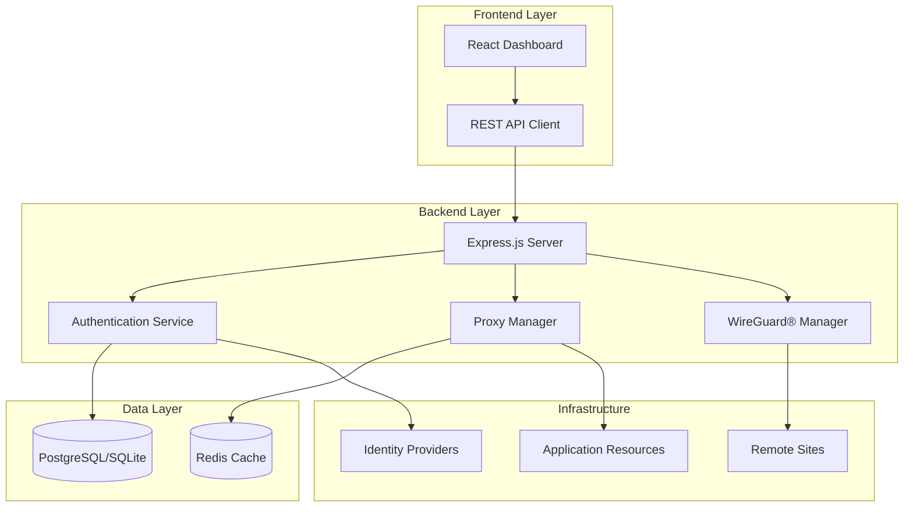

<div align="center">

# Aether Edge


**Identity-based, multi-site remote access platform using WireGuard®**

[](https://opensource.org/licenses/Apache-2.0)
[](https://nodejs.org/)
[](https://www.docker.com/)
[](https://www.typescriptlang.org/)

[Documentation](docs/README.md) • [Live Demo](https://demo.edge.skygenesisenterprise.com) • [API Reference](docs/api.md) • [Community](https://github.com/skygenesisenterprise/aether-edge/discussions)

</div>

---

## 🌟 Overview

**Aether Edge** is a comprehensive identity-based remote access platform that revolutionizes how organizations manage secure connectivity across multiple sites. By combining the power of WireGuard® tunnels with advanced identity and access management, Aether Edge provides enterprise-grade security with the simplicity of a modern web interface.

### 🎯 What Makes Aether Edge Different?

Traditional VPN solutions require complex configurations and lack granular access controls. Aether Edge solves this by:

- **Identity-First Security**: Access is based on user identity, not network location
- **Zero-Trust Architecture**: Every connection is authenticated and authorized
- **Centralized Management**: Control all sites and resources from a single dashboard
- **Developer-Friendly**: Comprehensive REST API for automation and integration

## ✨ Key Features

### 🔐 Advanced Identity & Access Management
- **Multi-Factor Authentication** (MFA) with TOTP and WebAuthn support
- **Single Sign-On (SSO)** integration with OIDC, SAML, and LDAP providers
- **Role-Based Access Control (RBAC)** with granular permissions
- **API Key Management** for programmatic access
- **User Lifecycle Management** with automated provisioning and deprovisioning

### 🌐 Multi-Site Secure Connectivity
- **WireGuard®-Based Tunnels** for fast, secure site-to-site connectivity
- **Automatic Network Discovery** and intelligent routing
- **Remote Exit Node Configuration** for flexible network topology
- **Support for Multiple Organizations** with isolated environments
- **Real-time Connection Monitoring** and health checks

### 🔄 Intelligent Proxy & Resource Management
- **HTTP/HTTPS Reverse Proxy** with custom headers and SSL termination
- **TCP/UDP Port Forwarding** for any application protocol
- **Path-Based Routing** with multiple match types (prefix, exact, regex)
- **IP-Based Access Rules** and geographic filtering
- **Load Balancing** across multiple targets with health checks

### 📊 Enterprise-Grade Management
- **Modern React Dashboard** with real-time updates and responsive design
- **Comprehensive Audit Logging** for compliance and security monitoring
- **Resource Usage Analytics** and performance metrics
- **Internationalization Support** with 15+ languages
- **Email Notifications** and customizable templates

### 🛠️ Developer & Operations Features
- **Multi-Database Support** (SQLite for development, PostgreSQL for production)
- **Docker Containerization** with multi-architecture support
- **Complete REST API** with OpenAPI 3.0 documentation
- **WebSocket Integration** for real-time events and updates
- **CLI Tools** for automation and scripting

## 🏗️ Architecture

Aether Edge is built with a modern, cloud-native architecture that scales from small teams to enterprise deployments:



### Technology Stack

- **Frontend**: Next.js 15, React 19, TypeScript, Tailwind CSS, Radix UI
- **Backend**: Express.js, TypeScript, Drizzle ORM, Winston Logging
- **Database**: PostgreSQL (production), SQLite (development)
- **Security**: WireGuard®, OAuth 2.0, OpenID Connect, WebAuthn
- **Infrastructure**: Docker, Kubernetes, Traefik, Redis

## 🚀 Quick Start

### Prerequisites

- **Node.js** 18.0 or higher
- **Docker** (optional but recommended)
- **WireGuard® tools** (for tunnel management)

### Installation Options

#### Option 1: Docker (Recommended)

```bash
# Clone the repository
git clone https://github.com/skygenesisenterprise/aether-edge.git
cd pangolin

# Configure and start
cp config/config.example.yml config/config.yml
docker-compose up -d

# Access the application
open http://localhost:3002
```

#### Option 2: Source Installation

```bash
# Clone and install
git clone https://github.com/skygenesisenterprise/aether-edge.git
cd pangolin
npm install

# Configure database
npm run set:sqlite
npm run db:sqlite:push

# Start development server
npm run dev
```

### First Steps

1. **Access Dashboard**: http://localhost:3002
2. **Create Admin Account**: Follow the setup wizard
3. **Configure Your First Site**: Add network and resources
4. **Invite Users**: Set up team members with appropriate roles
5. **Deploy Resources**: Configure applications and services

## 📖 Documentation

Our comprehensive documentation covers everything from basic setup to enterprise deployment:

### 📚 Essential Reading
- **[Installation Guide](docs/installation.md)** - Detailed setup instructions
- **[Quick Start Tutorial](docs/quick-start.md)** - Get running in 15 minutes
- **[API Documentation](docs/api.md)** - Complete REST API reference
- **[Configuration Guide](docs/configuration.md)** - All configuration options

### 🎯 User Guides
- **[User Management](docs/user-management.md)** - Managing users and permissions
- **[Site Configuration](docs/site-configuration.md)** - Setting up sites and networks
- **[Resource Management](docs/resource-management.md)** - Configuring applications
- **[Security Best Practices](docs/security.md)** - Security configuration guide

### 🛠️ Operations
- **[Deployment Guide](docs/deployment.md)** - Production deployment strategies
- **[Monitoring & Logging](docs/monitoring.md)** - Setting up observability
- **[Backup & Recovery](docs/backup.md)** - Data protection procedures
- **[Troubleshooting](docs/troubleshooting.md)** - Common issues and solutions

## 🏢 Use Cases

### 🏢 Enterprise Remote Access
- **Secure access** to corporate resources for remote employees
- **Multi-site connectivity** for branch offices and data centers
- **Vendor access** with limited, audited permissions
- **Compliance reporting** for security audits

### 🚀 Development & DevOps
- **Local development** access to staging environments
- **CI/CD pipeline** integration with automated access
- **Microservices** management and routing
- **API gateway** functionality with authentication

### 🌐 Service Providers
- **Multi-tenant** customer environments
- **Managed services** with customer portals
- **White-label** solutions for resellers
- **Usage-based billing** and metering

## 🎯 Build Variants

Aether Edge supports multiple deployment configurations:

### 🆓 Open Source (OSS)
- Core features for self-hosted deployments
- Community support and documentation
- Perfect for small to medium organizations

### 🏢 Enterprise
- Advanced security and compliance features
- High availability and clustering support
- Professional support and SLA guarantees
- Additional authentication providers

### ☁️ SaaS
- Multi-tenant architecture
- Built-in billing and subscription management
- Automated scaling and maintenance
- White-label customization options

Switch between variants:
```bash
npm run set:oss        # Open Source version
npm run set:enterprise # Enterprise features
npm run set:saas       # SaaS configuration
```

## 🗄️ Database Support

### SQLite (Development/Small Deployments)
- ✅ Zero configuration required
- ✅ Lightweight and portable
- ✅ Perfect for testing and small teams
- ✅ File-based backups

### PostgreSQL (Production/Enterprise)
- ✅ High performance and scalability
- ✅ Advanced features and extensions
- ✅ High availability and replication
- ✅ Professional tooling and support

## 🤝 Contributing

We welcome contributions from the community! Whether you're fixing bugs, adding features, or improving documentation, your help is appreciated.

### How to Contribute

1. **Fork the Repository**
2. **Create a Feature Branch** (`git checkout -b feature/amazing-feature`)
3. **Make Your Changes** following our coding standards
4. **Add Tests** for new functionality
5. **Submit a Pull Request** with a detailed description

### Development Setup

```bash
# Clone your fork
git clone https://github.com/skygenesisenterprise/aether-edge.git
cd aether-edge

# Install dependencies
npm install

# Set up development environment
npm run set:oss
npm run set:sqlite
npm run db:sqlite:push

# Start development server
npm run dev
```

### Code of Conduct

Please read our [Code of Conduct](CODE_OF_CONDUCT.md) to understand our community expectations.

## 📄 License

This project is licensed under the Apache License 2.0 - see the [LICENSE](LICENSE) file for details.

## 🆘 Support

### 📖 Self-Service Resources
- **[Documentation](docs/README.md)** - Comprehensive guides and references
- **[FAQ](docs/faq.md)** - Frequently asked questions
- **[Troubleshooting Guide](docs/troubleshooting.md)** - Common issues and solutions

### 💬 Community Support
- **[GitHub Discussions](https://github.com/skygenesisenterprise/aether-edge/discussions)** - Community Q&A
- **[Discord Server](https://skygenesisenterprise.com/discord)** - Real-time chat support

### 🏢 Professional Support
- **[Enterprise Support](https://pangolin.net/enterprise)** - 24/7 professional support
- **[Consulting Services](https://pangolin.net/consulting)** - Expert deployment assistance
- **[Training Programs](https://pangolin.net/training)** - Official certification

## 🏆 Acknowledgments

Aether Edge stands on the shoulders of giants. We're grateful to:

- **[WireGuard®](https://www.wireguard.com/)** - Fast, modern, and secure VPN tunnel
- **[Traefik](https://traefik.io/)** - The Cloud Native Application Proxy
- **[Next.js](https://nextjs.org/)** - The React Framework for Production
- **[Drizzle ORM](https://orm.drizzle.team/)** - TypeScript ORM for SQL databases
- **[Radix UI](https://www.radix-ui.com/)** - Unstyled, accessible UI components

## 🌟 Roadmap

### Upcoming Features
- [ ] **Advanced Analytics** - Machine learning-based threat detection
- [ ] **Mobile Apps** - Native iOS and Android applications
- [ ] **Advanced SSO** - More identity provider integrations
- [ ] **Network Segmentation** - Zero-trust network micro-segmentation
- [ ] **Compliance Reports** - Automated compliance reporting

### Long-term Vision
- [ ] **Global Edge Network** - Distributed edge locations
- [ ] **AI-Powered Optimization** - Intelligent traffic routing
- [ ] **Advanced Threat Protection** - Integrated security services
- [ ] **IoT Device Management** - Secure IoT device connectivity

---

<div align="center">

**[⭐ Star us on GitHub](https://github.com/skygenesisenterprise/aether-edge)** • **[🐛 Report Issues](https://github.com/skygenesisenterprise/aether-edge/issues)** • **[💡 Request Features](https://github.com/skygenesisenterprise/aether-edge/discussions)**

**Aether Edge** - *Secure Remote Access, Simplified.* 🚀

</div>